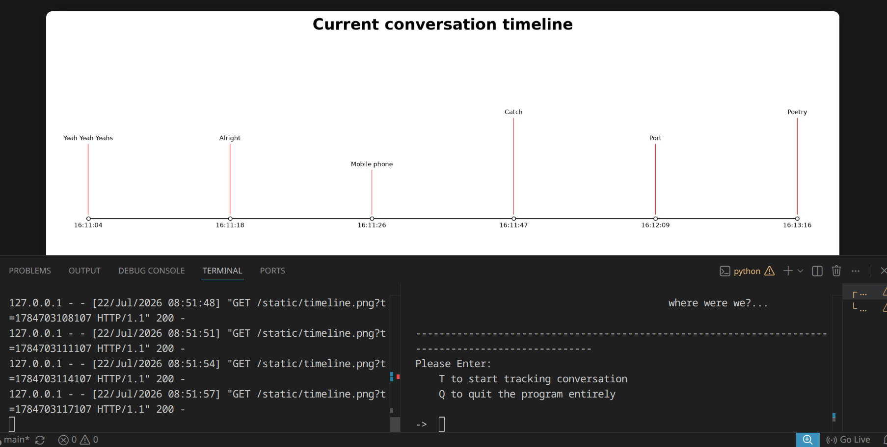

# Where-were-we?: A speech-to-text and topic anaylzer program

This project allows to user to have their speech transcribed and have the content of the speech be analyzed for what they are talking about.   

## Features

- Speech-to-text
- Topic analysation
- Visual tracking of the topics with time stamps 

## Demo / Screenshot



## Installation

```bash
git clone https://github.com/enkhosini/repo-name.git
cd repo-name
npm install
```

## Usage

First make a python virtual environment and install the requiremnts from the requirements.txt
(in linux)
```bash
python -m venv .venv
source .venv/bin/activate
pip install -r requirments.txt
```

### For the webpage run the following command then open the website link:
```bash
python app.py
```

## Configuration

I am planning to add better configuration for the program from terminal parameters, this is the MVP

## Roadmap

- [x] Speech-to-text 
- [x] Keyword Extraction
- [x] Topic search via API
- [x] Add visual description of the conversation timeline
- [ ] Add in-built or API accessed model for topic analyzation
- [ ] Calculate the nicheness of the topic at hand and display on the timeline 
 
## Contributing

Contributions are welcome! Please fork the repo and open a pull request.

## License

This project is licensed under the [MIT License](LICENSE).

## Contact

My strawpage – [@leiklooo](https://leiklooo.straw.page/) – you'll find my everything there

Project Link: [https://github.com/enkhosini/where-were-we](https://github.com/enkhosini/where-were-we)